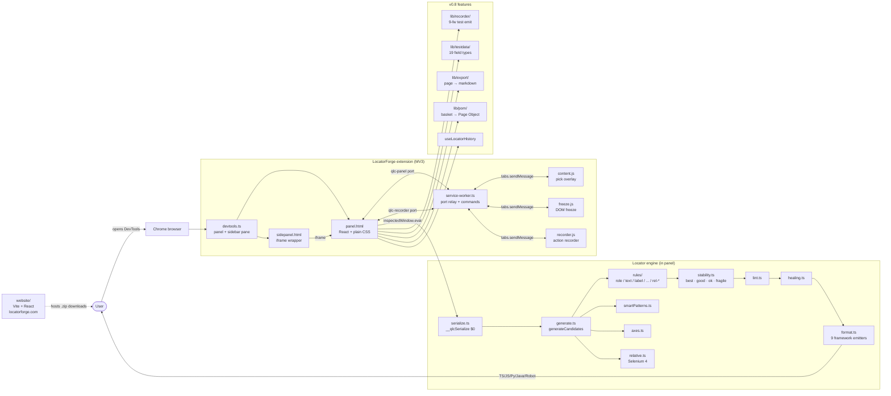
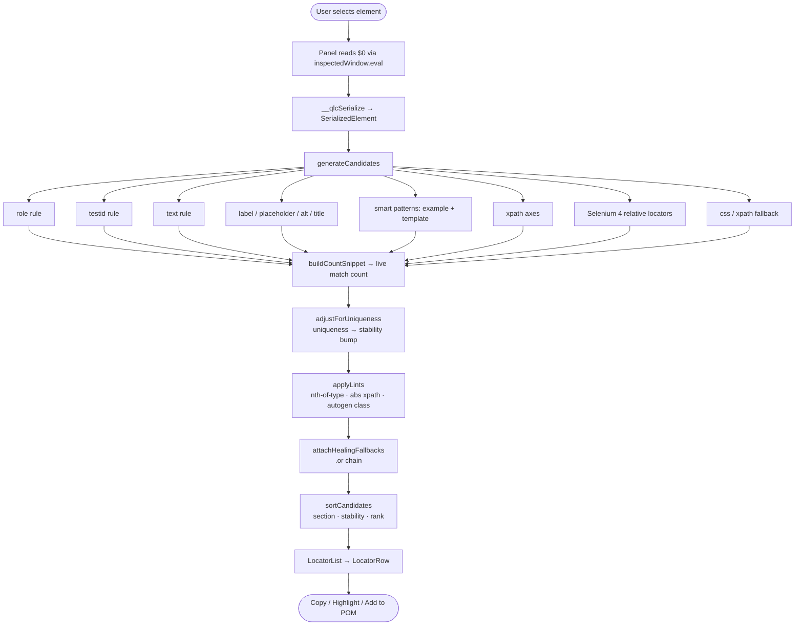

# LocatorForge

> Fast Chrome & Edge DevTools extension that generates Playwright, Selenium, Cypress, WebdriverIO and Robot Framework locators — straight from any element on a page. No ads. No tracking. No BS.

[](https://locatorforge.com)
[](./LICENSE)
[](./extension/package.json)
[](https://locatorforge.com)

**Live site:** [locatorforge.com](https://locatorforge.com)

---

## What it does

Open Chrome or Edge DevTools, click any element in the DOM tree (or use the pick mode), and LocatorForge produces a ranked list of test locators across 9 frameworks. Live match counts, stability ratings, parameterized smart patterns, self-healing chains, Selenium 4 relative locators, recorder, freeze mode, page-wide export — all in one DevTools tab.

## Architecture



## Locator generation pipeline



## Repo layout

```
locatorforge/
├── extension/                      # Chrome + Edge MV3 extension source
│   ├── src/
│   │   ├── devtools/               # devtools.ts — panel + Elements sidebar pane
│   │   ├── panel/                  # React panel UI
│   │   │   ├── App.tsx
│   │   │   ├── components/         # Toolbar, LocatorList, modals, ...
│   │   │   ├── hooks/              # useSelectedElement, useRecorder, useFreeze, ...
│   │   │   └── lib/
│   │   │       ├── locators/       # generation engine + Selenium 4 relative
│   │   │       ├── export/         # page-wide locator harvest
│   │   │       ├── recorder/       # action recorder emit
│   │   │       ├── testdata/       # 19-type test data generator
│   │   │       ├── pom/            # Page Object generator
│   │   │       └── messaging/      # port message types
│   │   ├── content/                # content.ts (pick), freeze.ts, recorder.ts
│   │   └── background/             # service-worker.ts (port relay, commands, contextMenus)
│   ├── public/                     # manifest.json + manifest.edge.json, sidepanel.html, icons
│   └── scripts/                    # build.mjs + package.mjs (--target=chrome|edge)
└── website/                        # Marketing site (Vite + React + Tailwind)
    ├── src/
    └── public/
        └── downloads/              # built extension zips land here (chrome + edge)
```

## Quick start

### Extension

```bash
cd extension
npm install

npm run build:chrome     # → extension/dist/chrome/
npm run build:edge       # → extension/dist/edge/

npm run package:chrome   # zips dist/chrome/ → ../website/public/downloads/locatorforge-chrome-v{VERSION}.zip
npm run package:edge     # zips dist/edge/   → ../website/public/downloads/locatorforge-edge-v{VERSION}.zip

npm run release          # build + package both browsers in one go
```

Load unpacked in Chrome:

1. `chrome://extensions` → Developer mode on
2. Load unpacked → select `extension/dist/chrome/`
3. Open any page → F12 → **LocatorForge** tab (or pin the LocatorForge sidebar inside Elements)

Load unpacked in Edge:

1. `edge://extensions` → Developer mode on (left sidebar)
2. Load unpacked → select `extension/dist/edge/`
3. Open any page → F12 → **LocatorForge** tab (or pin the LocatorForge sidebar inside Elements)

### Website

```bash
cd website
npm install
npm run dev         # http://localhost:5173
npm run build       # → website/dist/
```

Deploys to Vercel from the `website/` subdirectory.

## Features (v0.8.0)

### Locator generation
- **9 frameworks** — Playwright (TS/JS/Python/Java), Selenium (Java/Python), Cypress, WebdriverIO, Robot Framework
- **Stability scoring** with hover rationale — every candidate rated best/good/ok/fragile, with one-line "why this rating"
- **Smart Patterns** — parameterized templates for form inputs (`${placeholder}`, `${name}`, `${id}`, `${label}`)
- **XPath axes** — ancestor / following / preceding / sibling / parent
- **Selenium 4 relative locators** — `above` / `below` / `near` / `toLeftOf` / `toRightOf`
- **Self-healing chains** — Playwright `.or()` fallbacks
- **Locator linter** — flags absolute xpath, `nth-of-type`, auto-generated CSS class names
- **Shadow DOM + iframe** — auto-detect, auto-emit `frameLocator()` wrappers

### Workflows
- **Pick + highlight** — overlay-based picker; per-row flash on inspected page
- **Test Locator bar** — paste any CSS/XPath, see live match count, attribute autosuggest while typing
- **Action recorder** (`⌘⇧R`) — capture click / fill / select / press → emit full test in chosen framework
- **Freeze DOM** (`⌘⇧F`) — pause page mutations to inspect hover-only menus
- **Test data generator** (`⌘⇧D`) — 19 field types × realistic + edge + invalid columns
- **Page-wide export** (`⌘⇧E`) — harvest all interactive elements → markdown doc
- **Page Object generator** — basket → modal → full POM file
- **Locator history** — last 50 picks persisted across sessions
- **Configurable testid attribute** — `data-testid`, `data-qa`, `data-cy`, custom

### Surfaces
- **Top-level DevTools panel** — full-width workflow
- **Elements sidebar pane** — alongside Styles / Computed / Layout
- **Chrome / Edge Side Panel API** — opens without DevTools (`⌘⇧L` or click toolbar icon)

### Browser support
- **Chrome 116+** and **Microsoft Edge 116+** (plus other Chromium browsers like Brave and Arc)
- Separate `dist/chrome/` and `dist/edge/` builds, each with its own store-facing manifest
- The website offers dedicated download buttons for Chrome and Edge builds

## Privacy

Zero telemetry. Zero analytics. Zero remote calls. All settings live in `chrome.storage.sync` (your browser profile). The website itself uses no analytics, no cookies, no third-party scripts.

Required permissions (and only these): `activeTab`, `scripting`, `storage`, `contextMenus`, `sidePanel`.

## How this was built

See [`How_To_Create.md`](./How_To_Create.md) for the actual prompt sequence used to build LocatorForge with Claude Code.

## Contributing

Open to PRs.

## License

MIT © LocatorForge.
